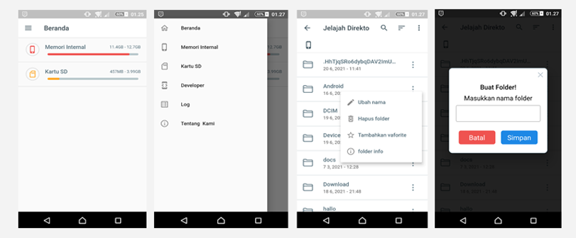

# Exaflorer - a filemanager created using flutter 

> this project might be discontinue in the future, caused by the lack of feature to gain a native permission related I/O in mountable storage such as SDcard and Flashdisk 

**Exaflorer** merupakan aplikasi filemanager yang dibuat menggunakan framework [flutter](www.flutter.com)

## Instalation And SetUp

Silahkan clone repository ini terlebih dahulu

    git clone https://github.com/CloudMyn/Exaflorer.git

Buka terminal anda pastikan terminal anda di dalam folder projek anda, kemudian copy command dibawah ini dan paste di terminal.

    flutter pub get

Setelah seluruh dependecies telah ter-install, silahkan copy salah satu command dibawah untuk menjalankan applikasinya :

    flutter run --release
    
    flutter run --debug
    
    flutter run --profile
    
Atau build langsung ke-target device kalian

    flutter build <target-device>

### -- Selamat Mencoba! --

